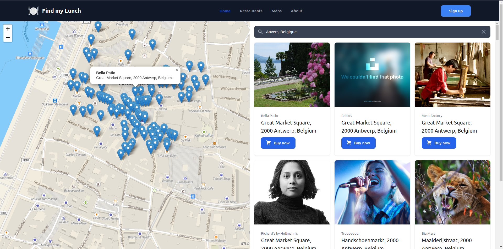

# Find my Lunch challenge API

* [ ] TODO
* [] Database Design/Requirements
    * [x] Think about db
    * [] Create schema for user, restaurant, order?, review?
* [x] Start Project Adonis
* [x] Defined structure
* [] Add restaurant to db
* [x] All user can see restaurant around him 
* [x] All user can see restaurant around request of search functionality 
* [] User-Registered can order to restaurant 
* [] User can register with social media
* [] caching ? redis ?  
* [] GraphQL ?  
 
[View all task in Notion](https://labboxstudio.notion.site/Tech-exercise-76273486360a47cdba1a693de4338baf)

### Questions
     Database{
        - Do i need to have restaurant in my database ??
        - Save response from api to pg ? i think is not really a good idea
        - Redis is database no ? Maybe save response in redis instead pg.. 
    }

-----------------------------------------

## Tech stack

- [PostgreSQL](https://www.postgresql.org/)
- [Redis](https://redis.io/)
- [Adonis](https://docs.adonisjs.com/guides/introduction)
## Library

- [Geoapify](https://apidocs.geoapify.com/)